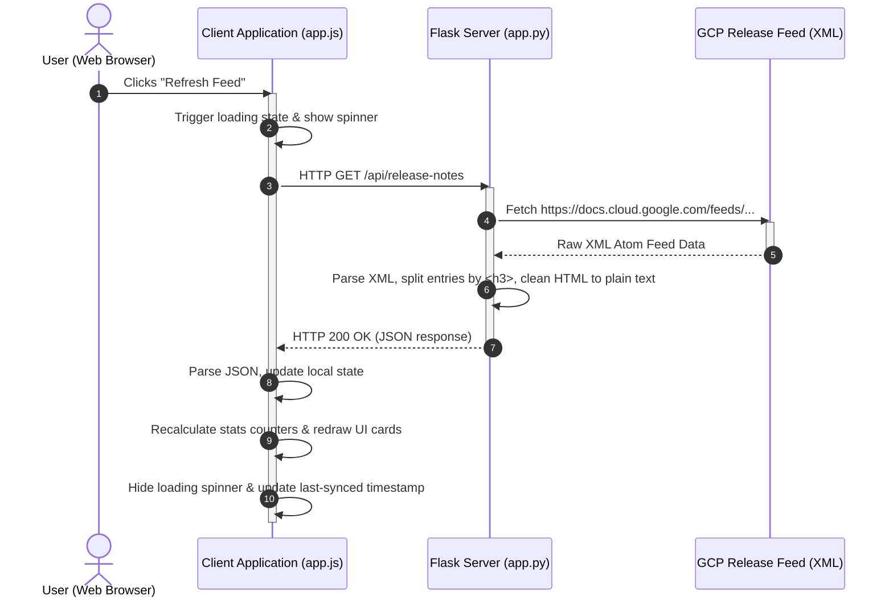

# BigQuery Release Notes Dashboard Architecture

This document provides a detailed breakdown of the BigQuery Release Notes Dashboard web application. It covers core features, details the server-side and client-side roles, and walks through a sample end-to-end request-response flow.

---

## 🌟 Main Features
1. **Real-time Sync**: Fetches the latest updates directly from the official Google Cloud BigQuery RSS/Atom XML feed.
2. **Granular Breakdown**: Parses single release dates (which often contain multiple announcements) into individual, color-coded item cards (e.g., Features, Issues, Changes).
3. **Interactive Dashboard**: Displays real-time metrics summarizing the total number of updates, features, issues, and system changes.
4. **Client-side Filter & Search**: Allows real-time text searching and category filtering without database or server reload delay.
5. **Selection & Tweet Sharing**: Supports selecting individual or multiple updates to generate optimized Twitter Web Intent messages automatically fitting within the 280-character limit.

---

## 🖥️ Architecture Breakdown

### 1. Server-Side (Python Flask)
Located in [app.py](file:///Users/sumittade/bigquery_release_notes/app.py), the backend serves two main roles:

* **Static File Server**: Delivers the initial HTML, CSS, and JS shell resources to the browser.
* **API Service (`/api/release-notes`)**:
  - Fetches the XML feed from Google Cloud.
  - Parses the raw XML data using python's built-in `xml.etree.ElementTree`.
  - Employs regex pattern matching `r'<h3>(.*?)</h3>(.*?)(?=<h3>|$)'` to subdivide multi-part updates within each `<entry>` element.
  - Cleans HTML markup (tags and escape characters) into a plaintext format specifically prepared for tweet compilation.
  - Formats data into a structured JSON response.

### 2. Client-Side (Vanilla HTML, CSS, and JS)
The frontend is decoupled from the XML parsing logic to provide a smooth, application-like user experience:

* **Structure & UI ([index.html](file:///Users/sumittade/bigquery_release_notes/templates/index.html))**: Employs clean HTML5 semantic nodes (`<header>`, `<main>`, `<section>`) and embeds responsive inline SVG icons.
* **Presentation Layer ([style.css](file:///Users/sumittade/bigquery_release_notes/static/css/style.css))**: 
  - Styled with custom properties for a premium glassmorphic dark theme.
  - Employs keyframe animations for loading spinners and card layout shimmers.
  - Responsive grids adjusting from wide-screen monitors to mobile devices.
* **Behavior & Logic ([app.js](file:///Users/sumittade/bigquery_release_notes/static/js/app.js))**:
  - Stores local app state (`releaseEntries`, `selectedUpdates`, `searchQuery`, `currentFilter`).
  - Fetches and processes backend payloads asynchronously.
  - Updates counters dynamically.
  - Compiles tweet payloads and launches browser popups using Twitter intents.

---

## 🔄 Sample Request-Response Flow

Below is the sequence diagram illustrating what happens when you load the dashboard or click the **Refresh Feed** button.

### Flow Breakdown

1. **User Action**: The user clicks **Refresh Feed**.
2. **Frontend UI State change**: `app.js` captures the click, disables the button, and activates the rotating animation on the SVG spinner.
3. **API Request**: The frontend makes an asynchronous `fetch()` request to `/api/release-notes`.
4. **Data Sourcing**: The Flask server contacts Google Cloud to pull the live XML document.
5. **Feed Return**: Google responds with XML.
6. **Data Processing**:
   - The server walks through the tree structure to find `<entry>` nodes.
   - For each entry, it parses `<content>` to separate different `<h3>` headers (such as `<h3>Feature</h3>` vs `<h3>Issue</h3>`).
   - It runs `re.sub()` to produce clean text for tweets and returns the structured payload.
7. **JSON Return**: Flask returns the JSON structure.
8. **State Sync**: The browser parses the JSON and populates the local state array.
9. **UI Render**: A loop redraws the cards, matches them against current filter tabs or search queries, and recalculates the statistics counter numbers.
10. **State Resolution**: The loader spinner is hidden, and the new timestamp is rendered.
